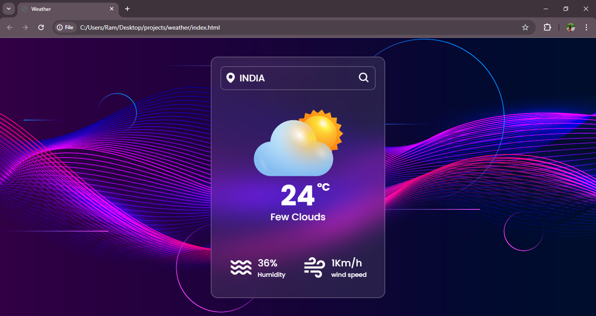

<h1>
  Weather website
</h1>
<h3>
  summary
</h3>

  This project is a responsive, user-friendly weather website that provides real-time weather information for cities worldwide. Built with HTML, CSS, and JavaScript, it integrates with a weather API to fetch and display data like temperature, humidity, wind speed, and general weather conditions. Users can simply enter a city name to retrieve up-to-date information, with visual icons representing different weather types (sunny, cloudy, rainy, etc.) for easy interpretation.

The layout is clean and modern, styled with CSS for responsiveness across various devices. JavaScript handles the API interactions and dynamically updates the weather data on the page, while error handling ensures a smooth user experience even for invalid or unresponsive requests. This project serves as an excellent example of integrating third-party APIs and demonstrates the power of JavaScript in creating interactive and informative web applications.

